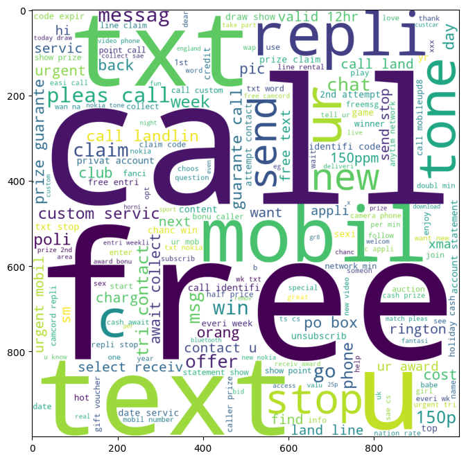
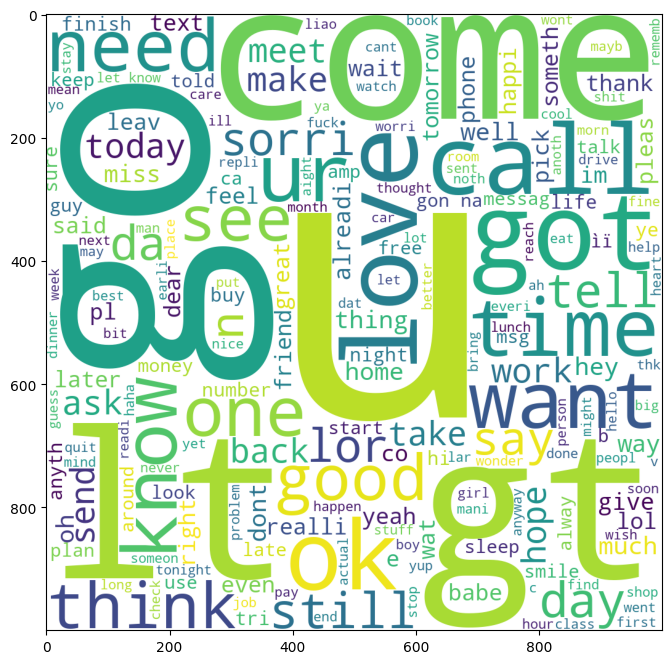

# Spam Mail Detection

A machine learning project for detecting spam emails using the Multinomial Naive Bayes algorithm. This project uses Python libraries such as scikit-learn, SciPy, NumPy, and Pandas, with a Streamlit-based web application for a user-friendly interface.

## Features
- **Spam Classification:** Classifies emails as spam or not based on content.
- **Interactive UI:** Uses Streamlit for an easy-to-use web-based interface.
- **Pretrained Model:** Saves the trained model and vectorizer using Pickle for reuse.

## Installation

1. **Clone the repository:**
   ```bash
   git clone https://github.com/yourusername/spam-mail-detection.git
   cd spam-mail-detection
   ```

2. **Install the required dependencies:**
   ```bash
   pip install -r requirements.txt
   ```

   The `requirements.txt` file includes:
   ```
   scikit-learn
   scipy
   numpy
   pandas
   streamlit
   ```

## Usage

1. **Train the model:** (Optional, if not using the pre-trained model)
   ```bash
   main.ipynb
   ```

2. **Run the Streamlit web app:**
   ```bash
   streamlit run app.py
   ```

3. **Navigate to:** `http://localhost:8501` in your web browser.

## Project Structure

```
SPAM_MAIL/
├── .devcontainer/          # Optional: Development environment setup
├── app.py                  # Streamlit application
├── ham.png                 # Screenshot showing ham (not spam) detection
├── main.ipynb              # Jupyter notebook for model training and experimentation
├── main.py                 # Python script for model training
├── model.pkl               # Pre-trained model saved with Pickle
├── requirements.txt        # List of required packages
├── spam.csv                # Dataset containing email data for training
├── spam.png                # Screenshot showing spam detection
├── test.md                 # Test file for experimenting with markdown documentation
└── vectorizer.pkl          # Saved vectorizer (TF-IDF)
```

## Data Preprocessing

The data preprocessing steps include:
1. **Loading the dataset (`spam.csv`)**: This dataset should have columns for text and label.
2. **Cleaning and tokenizing text**: Removing punctuation, converting to lowercase, and stemming.
3. **Vectorizing the text data**: Using TF-IDF vectorization for converting text to numeric form.

## Model Training

The model is trained using the `MultinomialNB` classifier:
1. Split the data into training and testing sets.
2. Preprocess the text data.
3. Train the model on the training data.
4. Save the trained model (`model.pkl`) and vectorizer (`vectorizer.pkl`) for future use.

## Web Interface

The project includes a Streamlit web app (`app.py`) where users can input email content to classify it as spam or not spam.

## Screenshots

### Spam Detection


### Ham Detection


## Future Enhancements

- **Expand the dataset** to improve model performance.
- **Implement other machine learning algorithms** to compare effectiveness.
- **Add real-time email classification** by integrating with an email client.
- **Deploy the app online** using platforms like Streamlit Sharing, Heroku, or Vercel.

## Contributing

Contributions are welcome! Please fork this repository and submit a pull request for any improvements or new features.

## License

This project is licensed under the MIT License. See the [LICENSE](LICENSE) file for more information.
